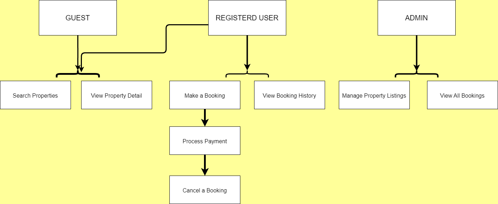

# Requirement Analysis in Software Development.

## Introduction

This repository serves as a guide to understanding the critical process of requirement analysis in software development lifecycle (SDLC). It includes methodologies, best practices, and resources to help developers and teams effectively gather, analyze, and document requirements for their projects.

## What is Requirement Analysis?

- **Requirement Analysis** is a critical phase in the software development lifecycle (SDLC) where the project team gathers, analyzes, and defines the requirements of the software product to be developed. This process ensures that all stakeholders have a clear and mutual understanding of what the system should do and how it should perform.

- **Requirement Analysis** involves various activities such as requirement elicitation, documentation, validation, and prioritization. By meticulously analyzing requirements, teams can build a roadmap for successful project completion.

## Why is Requirement Analysis Important?

Requirement Analysis is a cornerstone of successful software development. Here are five key reasons why it is critical in the SDLC:

1. **Clarity and Understanding**: It helps in understanding what the stakeholders expect from the software, reducing ambiguity.
2. **Scope Definition**: Clearly defines the scope of the project, which helps in preventing scope creep.
3. **Basis for Design and Development**: Provides a solid foundation for designing and developing the system.
4. **Cost and Time Estimation**: Facilitates accurate estimation of project cost, resources, and time.
5. **Quality Assurance**: Ensures that the final product meets the specified requirements, leading to higher customer satisfaction.

## Key Activities in Requirement Analysis

Requirement Analysis involves several critical activities, each contributing to the development of a clear and actionable set of requirements:

- **Requirement Gathering**:

  - Collecting input from stakeholders, users, and other sources to identify what is needed in the project. This step involves conducting meetings, interviews, and surveys to compile initial requirements.

- **Requirement Elicitation**:

  - Extracting detailed and specific requirements from stakeholders. Techniques include brainstorming sessions, focus groups, observation, and use case analysis to uncover hidden or implied needs.

- **Requirement Documentation**:

  - Recording the requirements in a structured and clear format. Common documentation includes requirement specifications, user stories, and use case diagrams to ensure that all stakeholders are on the same page.

- **Requirement Analysis and Modeling**:

  - Evaluating the collected requirements to ensure feasibility, consistency, and alignment with project goals. This step often involves modeling techniques such as data flow diagrams, process flows, or entity-relationship diagrams to visualize and refine requirements.

- **Requirement Validation**:
  - Ensuring that the requirements are accurate, complete, and meet stakeholder needs. Validation involves reviewing, verifying, and obtaining approval from stakeholders to confirm that the requirements are ready for implementation.

By following these activities, teams can ensure that requirements are well-defined, achievable, and aligned with the project's overall objectives.

## Types of Requirements

Requirements in software development can be categorized into two types: **Functional Requirements** and **Non-functional Requirements**. Both are essential for the success of a project.

### Functional Requirements

Functional Requirements define the specific behaviors or functions of a system. These describe what the system should do to meet the user and business needs.

#### Examples of Functional Requirements for a Booking Management Project:

(refer to [case study](https://medium.com/nerd-for-tech/system-design-architecture-for-hotel-booking-apps-like-airbnb-oyo-6efb4f4dddd7)).

- Allow customers to search and book a hotel.
- Enable searching for available rooms.
- Send notification to the hotel manager whenever a customer books a hotel.
- Provide a payment gateway for processing payments.

### Non-functional Requirements

Non-functional Requirements specify the quality attributes of a system, such as performance, usability, and reliability. These describe how the system performs its functions.

#### Examples of Non-Functional Requirements for a Booking Management Project:

(refer to [case study](https://medium.com/nerd-for-tech/system-design-architecture-for-hotel-booking-apps-like-airbnb-oyo-6efb4f4dddd7)).

- The Customer/Manager app sends the request to the load balancer and it distributes the request to booking management servers.
- Reduce page loading time.
- Reduce load on the database
- The system should handle multiple concurrent user requests.

Understanding and documenting both types of requirements ensures a comprehensive approach to project development, balancing functionality with performance and user experience.

## Use Case Diagrams

### What are Use Case Diagrams?

Use Case Diagrams are a visual representation of the functional requirements of a system. They show how different users (actors) interact with the system to achieve specific goals (use cases).

### Benefits of Use Case Diagrams:

- Provide a clear visual representation of system functionalities.
- Help in identifying and organizing system requirements.
- Facilitate communication among stakeholders and development team.

### Use Case Diagram for Booking System

Below is the Use Case Diagram for a booking management system. It illustrates the key actors and their interactions with the system:

- **Actors**:

  - **Guest**: A user who can search properties and view details.
  - **Registered User**: A user who can view, search and book properties and cancel bookings.
  - **Admin**: A system manager who can manage property listings, view all bookings, and handle user accounts.

- **Use Cases**:
  - View Property Details.
  - Search for properties.
  - Make a booking.
  - Cancel a booking.
  - manage listings.
  - View booking history.

#### Diagram:

## Acceptance Criteria

### What is Acceptance Criteria?

Acceptance Criteria are specific, measurable conditions that a software feature or product must meet to be considered complete and acceptable by stakeholders. They define the scope of functionality and quality expectations for a particular feature, acting as a benchmark to determine whether the implementation is correct and meets user needs.

### Importance of Acceptance Criteria in Requirement Analysis:

- **Clarity**: Provides a shared understanding of the expected functionality and behavior of a feature among stakeholders and the development team.
- **Guidance**: Serves as a reference for developers, testers, and product owners to ensure that the feature meets its intended purpose.
- **Scope Definition**: Helps prevent scope creep by clearly outlining what is included and excluded in the feature implementation.
- **Testing Basis**: Acts as a foundation for writing test cases to validate the feature’s functionality.

### Example: Acceptance Criteria for the Checkout Feature

For the **Checkout** feature in a booking management system, here are some sample acceptance criteria:

#### User Story:

**As a customer**, I want to complete my booking by making a payment securely so that I can confirm my reservation.

#### Acceptance Criteria:

1. **Booking Summary**:

   - The system should display a summary of the booking, including room details, dates, and total cost before proceeding to payment.
   - The summary should also include any applicable taxes and discounts.

2. **Payment Options**:

   - The system should provide at least three payment options: Credit Card, PayPal, and Bank Transfer.
   - Payment forms must be validated to ensure all required fields are filled before submission.

3. **Payment Confirmation**:

   - Upon successful payment, the system should display a confirmation message with the booking details.
   - A confirmation email should be sent to the customer with a unique booking reference number.

4. **Error Handling**:

   - If payment fails, the system should notify the user with an appropriate error message and provide an option to retry.

5. **Security**:
   - All payment transactions must be encrypted using SSL/TLS to ensure data security.
   - The system should comply with PCI-DSS standards for handling payment information.

Acceptance Criteria ensure that all stakeholders agree on what constitutes a completed and satisfactory implementation of a feature, reducing ambiguity and improving the quality of the deliverable.
